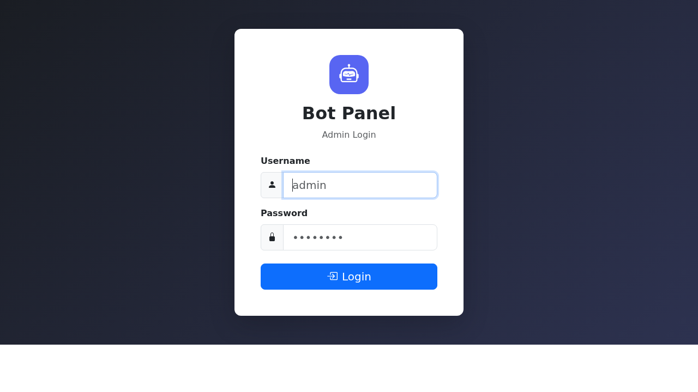
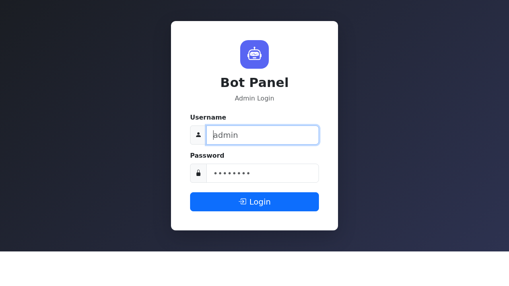
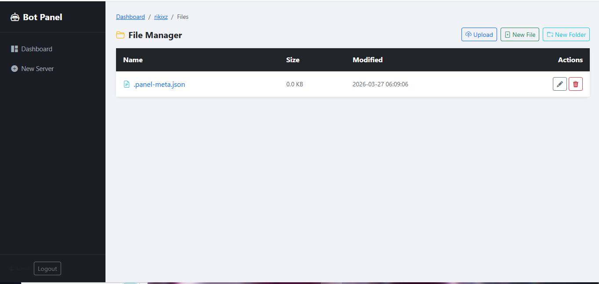

# 🤖 Discord Bot Hosting Panel

> **A professional, self-hosted Discord bot management platform with real-time monitoring, SQLite database, resource limits, and multi-user support.**

<p align="center">
  
  
  
  
  
</p>

---

## 📸 Screenshots

### Login Page


### Dashboard with Real-Time Stats


### Settings Panel


### File Manager


---

## ✨ Features

### 🎛️ Server Management
- **Create / Delete** bot servers instantly
- **Start / Stop / Restart** with one click
- **ZIP Upload** — Deploy bots by uploading a zip file on creation
- **File Manager** — Browse, create, edit, upload and delete files
- **Code Editor** — In-browser editing with syntax highlighting (Ctrl+S to save, Tab key support)
- **NPM Installer** — Install packages directly from the panel per-bot

### 📊 Real-Time Monitoring
- **Live CPU Usage** — Per-server and system-wide with progress bars
- **Live RAM Usage** — Track memory consumption in real-time
- **System Uptime** — Always visible in the stat cards
- **Live Log Streaming** — See stdout/stderr in real-time via WebSocket (Socket.io)
- **Auto-scroll toggle** — Pin or unpin log tailing

### 🔒 Resource Limits (per bot)
- **RAM Limit** — Set max memory (64 MB – 8 GB), enforced via `NODE_OPTIONS`
- **CPU Limit** — Cap CPU usage percentage (10% – 100%)
- **Server Quotas** — Limit max servers per sub-user
- **Editable** — Change limits anytime from the server settings modal

### 🗄️ SQLite Database
- All panel data stored in `panel.db` (auto-created on first run)
- **settings** table — site name, logo, default limits
- **users** table — admin + sub-users with bcrypt hashed passwords
- **servers** table — bot metadata (name, entry point, RAM/CPU limits)
- No external database required

### 👥 Multi-User Support
- **Sub-User Accounts** — Create accounts for team members
- **Per-User Limits** — Custom max servers & RAM per user
- **Admin Panel** — Full user management (create / delete)
- **Secure Sessions** — Express-session based auth

### 🎨 Branding & Customization
- **Custom Site Name** — Change the panel name
- **Logo Upload** — Upload your own logo (PNG, JPG, GIF, SVG, WEBP)
- **Logo URL** — Or just paste a URL
- **Mobile Responsive** — App-like UI on phones with bottom navigation bar

### 🌐 Hosting
- **Cloudflare Tunnel** — Expose locally without port forwarding (no domain needed)
- **Quick Deploy** — Runs on any Node.js 18+ environment
- **SQLite** — No external database required, just one file

---

## 📁 Project Structure

```
discord-bot-panel/
│
├── server.js              # Entry point — Express + Socket.io setup
├── config.js              # Config loader (reads from SQLite settings)
├── database.js            # SQLite database layer (better-sqlite3)
├── package.json           # Dependencies
├── .env.example           # Environment variables template
│
├── middleware/
│   └── auth.js            # Session authentication middleware
│
├── routes/
│   ├── auth.js            # GET/POST /login, GET /logout
│   ├── dashboard.js       # GET / dashboard, GET /api/stats
│   ├── servers.js         # CRUD + process control for bots
│   ├── files.js           # File manager routes
│   └── settings.js        # Panel settings & user management
│
├── services/
│   └── processManager.js  # Spawn, monitor, kill Node.js bot processes
│
├── views/                 # EJS templates
│   ├── layout.ejs         # Base layout (sidebar, bottom nav, modals)
│   ├── login.ejs          # Login page
│   ├── dashboard.ejs      # Main dashboard with live stat cards
│   ├── server-detail.ejs  # Bot management (logs, controls, NPM)
│   ├── file-manager.ejs   # File browser
│   ├── file-editor.ejs    # In-browser code editor
│   └── settings.ejs       # Admin settings page
│
├── public/
│   ├── css/style.css      # Custom styles (Bootstrap override)
│   └── js/app.js          # Frontend utilities
│
├── screenshots/           # GitHub README screenshots
│   ├── login.png
│   ├── dashboard.png
│   ├── settings.png
│   └── file-manager.png
│
├── servers/               # Bot directories (auto-created)
│   └── <server-id>/       # Each bot lives here
│       ├── index.js       # Bot entry point
│       ├── package.json
│       └── ...
│
└── panel.db               # SQLite database (auto-created on first run)
```

---

## 🚀 Quick Start

### Prerequisites
- **Node.js 18+**
- **npm** or **yarn**

### Installation

```bash
# 1. Clone or unzip the project
cd discord-bot-panel

# 2. Install dependencies
npm install

# 3. Configure environment
cp .env.example .env
# Edit .env — change SESSION_SECRET at minimum

# 4. Start the panel
npm start
```

Open **http://localhost:3000**

**Default credentials:**
- Username: `admin`
- Password: `admin123`

> ⚠️ **Change the password immediately** after first login via Settings!

---

## ⚙️ Configuration

### Environment Variables (`.env`)

| Variable         | Default                     | Description                  |
|------------------|-----------------------------|------------------------------|
| `PORT`           | `3000`                      | Server port                  |
| `SESSION_SECRET` | `changeme_super_secret_key` | Session encryption key       |
| `ADMIN_USER`     | `admin`                     | Initial admin username       |
| `ADMIN_PASS`     | `admin123`                  | Initial admin password       |

> After first run, credentials are stored in SQLite. Changing `.env` values only affects the initial seeding.

### Panel Settings (via Settings UI)

| Setting                | Default | Range       | Description                  |
|------------------------|---------|-------------|------------------------------|
| Default RAM Limit      | 512 MB  | 64–8192 MB  | Default memory limit per bot |
| Default CPU Limit      | 100%    | 10–100%     | Default CPU cap              |
| Max Servers Per User   | 5       | 1–50        | Server quota per sub-user    |

---

## 🗄️ Database Schema (SQLite)

```sql
-- Panel configuration
CREATE TABLE settings (
  key   TEXT PRIMARY KEY,
  value TEXT NOT NULL
);

-- Admin and sub-users
CREATE TABLE users (
  id          INTEGER PRIMARY KEY AUTOINCREMENT,
  username    TEXT UNIQUE NOT NULL,
  password    TEXT NOT NULL,          -- bcrypt hashed
  role        TEXT NOT NULL DEFAULT 'user',
  max_servers INTEGER NOT NULL DEFAULT 3,
  max_ram     INTEGER NOT NULL DEFAULT 512,
  created_at  DATETIME DEFAULT CURRENT_TIMESTAMP
);

-- Bot server metadata
CREATE TABLE servers (
  id          TEXT PRIMARY KEY,       -- short UUID
  name        TEXT NOT NULL,
  entry_point TEXT NOT NULL DEFAULT 'index.js',
  ram_limit   INTEGER NOT NULL DEFAULT 512,
  cpu_limit   INTEGER NOT NULL DEFAULT 100,
  owner       TEXT,
  created_at  DATETIME DEFAULT CURRENT_TIMESTAMP
);
```

---

## 🌐 Cloudflare Tunnel Setup

```bash
# Install cloudflared
wget https://github.com/cloudflare/cloudflared/releases/latest/download/cloudflared-linux-amd64
chmod +x cloudflared-linux-amd64
sudo mv cloudflared-linux-amd64 /usr/local/bin/cloudflared

# Start tunnel (one command — no account needed)
cloudflared tunnel --url http://localhost:3000
```

You'll get a public URL like:
```
https://something-something.trycloudflare.com
```

---

## 🛠️ API Endpoints

| Method | Endpoint                    | Description                       |
|--------|-----------------------------|-----------------------------------|
| GET    | `/api/stats`                | Real-time system + server stats   |
| GET    | `/servers/:id/status`       | Server status, CPU & RAM usage    |
| GET    | `/servers/:id/logs`         | Server log history                |
| POST   | `/servers/create`           | Create new bot server             |
| POST   | `/servers/:id/start`        | Start bot process                 |
| POST   | `/servers/:id/stop`         | Stop bot process                  |
| POST   | `/servers/:id/restart`      | Restart bot process               |
| POST   | `/servers/:id/npm`          | `npm install <packages>`          |
| POST   | `/servers/:id/meta`         | Update server name/entry/limits   |
| POST   | `/servers/:id/delete`       | Delete server + files             |
| GET    | `/files/:id`                | Browse directory                  |
| GET    | `/files/:id/edit`           | Get file for editing              |
| POST   | `/files/:id/edit`           | Save file                         |
| POST   | `/files/:id/upload`         | Upload file to directory          |
| POST   | `/files/:id/delete`         | Delete file or folder             |
| POST   | `/files/:id/new-file`       | Create empty file                 |
| POST   | `/files/:id/new-folder`     | Create folder                     |

---

## 📱 Mobile Support

The panel is fully responsive with:
- **Bottom navigation bar** on mobile (hidden on desktop)
- **Touch-optimized buttons** (44px minimum)
- **App-like experience** — splash screen style login, smooth nav
- **iOS zoom prevention** — 16px font-size on inputs

---

## 🔐 Security Notes

1. **Change default credentials** before deploying
2. **Use HTTPS** in production (Cloudflare Tunnel provides this automatically)
3. **Run behind reverse proxy** (nginx/Caddy) for production
4. **Regular backups** of `panel.db` and the `servers/` directory
5. **Sub-users** have isolated server access
6. Passwords are **bcrypt hashed** in the database

---

## 📊 System Requirements

| Resource | Minimum | Recommended |
|----------|---------|-------------|
| RAM      | 256 MB  | 1 GB+       |
| CPU      | 1 core  | 2+ cores    |
| Storage  | 1 GB    | 10 GB+      |
| Node.js  | 18+     | 20+         |

---

## 🤝 Contributing

1. Fork the repository
2. Create your feature branch (`git checkout -b feature/AmazingFeature`)
3. Commit your changes (`git commit -m 'Add some AmazingFeature'`)
4. Push to the branch (`git push origin feature/AmazingFeature`)
5. Open a Pull Request

---

## 📄 License

MIT License — see [LICENSE](LICENSE) for details.

---

## 👨‍💻 Author

**Rikixz**

<p align="left">
  <a href="https://github.com/blaxkmiradev">
    
  </a>
</p>

- 🐙 GitHub: [@blaxkmiradev](https://github.com/blaxkmiradev)

---

## 🙏 Acknowledgments

- [Express.js](https://expressjs.com/) — Web framework
- [Bootstrap 5](https://getbootstrap.com/) — UI framework
- [Socket.IO](https://socket.io/) — Real-time WebSocket communication
- [better-sqlite3](https://github.com/WiseLibs/better-sqlite3) — SQLite database
- [bcryptjs](https://github.com/dcodeIO/bcrypt.js) — Password hashing
- [Cloudflare](https://cloudflare.com/) — Tunnel hosting
- [EJS](https://ejs.co/) — Templating engine

---

<p align="center">
  <strong>Made with ❤️ by <a href="https://github.com/blaxkmiradev">Rikixz</a></strong>
</p>

<p align="center">
  
  
</p>
